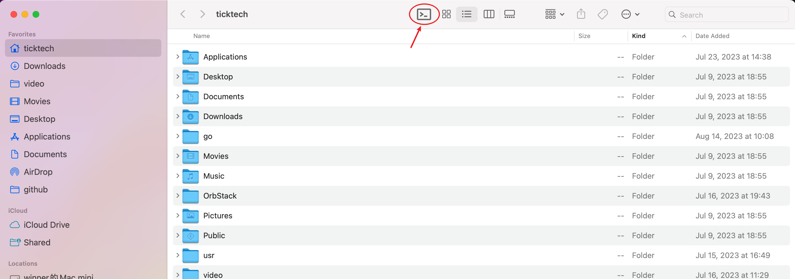

# go2iterm2

An another optional to Go2Shell. Support iterm2 only. It is written in **javascript**. Only **22** lines of effective code.

Easy to modify and understand. Enjoy it.

# install

- Copy the app to /Applications
- Open another Finder window. Select menu: `View->Customize Toolbar`. Drag the app to the toolbar
- Click the new icon on the toolbar
- That's it.

# Screenshot

